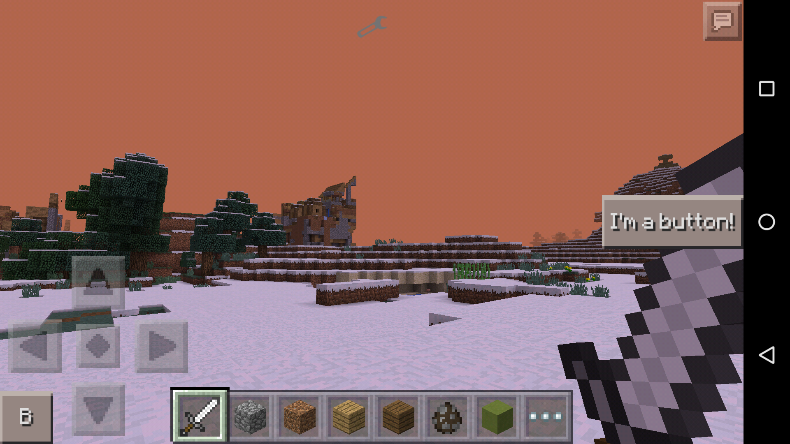

Minecraft Button Library for MCPE mods
=========
The Minecraft Button Library brings a nice Minecraft style for your buttons created with the android.widget.Button class.<br>
This library is intendent to work only for Minecraft Pocket Edition mods, also known as ModPE Scripts.

Version
---------
1.2.0

Screenshots
---------


Features
---------
  - Easy installation (you just have to copy the code of the library in your mod)
  - Easy upgrade from the default Android buttons to the Minecraft style button: only one line of code has to be changed
  - Works with every device, resolution and screen density!

Installation
---------
As mentioned before, the installation is pretty easy, you just have to copy all the `library.js` code into your ModPE script.

Example
---------
If you want to see how this library looks you can try the `mod-test.js`.<br>
The test buttons are displayed when you hold the Iron Sword in the game.<br>
Just copy this link `link` and paste it in BlockLauncher/Manage ModPE Scripts/Import/Web address.

Upgrade
---------
Example of the code of the default Android button: 
```javascript
var button1 = new android.widget.Button(com.mojang.minecraftpe.MainActivity.currentMainActivity.get());
button1.setOnClickListener(new android.view.View.OnClickListener()
{
	onClick: function(v)
	{
		clientMessage("You clicked me");

		return false;
	}
});
button1.setText("I'm a button!");
```

Example of the code of the Minecraft style button:
```javascript
var button1 = MinecraftButton();
button1.setOnClickListener(new android.view.View.OnClickListener()
{
	onClick: function(v)
	{
		clientMessage("You clicked me");

		return false;
	}
});
button1.setText("I'm a Minecraft button!");
```

Known bugs
---------
No bugs found.<br>
If you find one bug you can report it here on the Github repository. Just create a new issue and explain what the bug is.

Missing features
---------
Currently the Minecraft background image is NOT extracted from the Texture Pack.<br>
So whatever Texture Pack you're using you'll always get the default Minecraft style of the button.


License
---------
MIT
